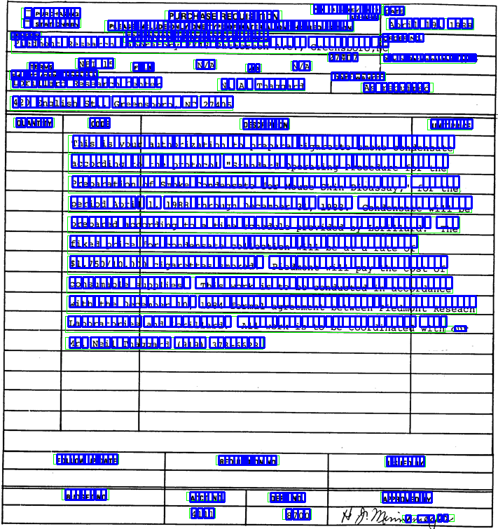

# TableRecognition
Recognize tables from images and restore them into word/crnn single character coordinates  
从图像还原表格并以word形式保存/crnn单字坐标提取（解决文字跨表格单元格识别）
### Demo

  
Final .docx file in word directory
### Model weights
Maybe one of the best open weights of document text detection and recognition.  
也许是最好的开源印刷体文档文本检测和识别权值之一  
Google drive link   
[PSE weight](https://drive.google.com/file/d/1NAQ8aiOLfyKt0xAmpszhO8YbwAxuVG8o/view?usp=sharing)  
[CRNN weight](https://drive.google.com/file/d/1KIMhHtL7azYcYRfv_0VSKXi-OI25dCml/view?usp=sharing)  
[Unet weight](https://drive.google.com/file/d/1e5HET6dulQcFGv_V5VPvFnmKAjF_cwEq/view?usp=sharing)  
[pkl for edit distance](https://drive.google.com/file/d/1RAANkxEa_GmSDvUbwodUZ_7z95Ihz1Ux/view?usp=sharing)
### How to run
~~1. python server.py~~  
~~Load the unet model to extract table lines from the input image~~  
~~2. python test.py~~  
~~Feed the input image~~  
(Table line detection model is not very robust, but I will reserve the related files maybe I will update it later.
开源的表格线检测模型泛化能力不够强，暂时搁置。保留之前的代码和模型，仅作参考)  
1. Edit PSE/config/config.py, crnn/config/config.py to set use GPU/CPU and model path.  
   修改PSE/config/config.py, crnn/config/config.py这两个文件配置文件，配置运行设备和模型地址  
2. python image2word.py  
   Restore table use opencv & python-docx, text detection: psenet, text recognition: crnn & edit distance  
   采用opencv和python-docx还原表格， 文本检测部分采用psenet， 文本识别部分采用resnet18-bilstm-ctc加编辑距离校正

### Tips  
~~Step 1 & 2 are not necessary if you have quite neat PDF images, meanwhile this project
can't deal with some complex samples like tortuous and colorful receipts, I am still working on it.~~
  
### To do
I am handling complex table recognition, struggling with dataset.
~~Optimistically, there could be a radical change in weeks. If you are researching page 
layout and table recognition, please contact me.~~[lizongxi1995@gmail.com](lizongxi1995@gmail.com)

### Reference and some useful projects
1. [https://github.com/chineseocr/table-ocr.git](https://github.com/chineseocr/table-ocr.git)
2. [https://github.com/weidafeng/TableCell.git](https://github.com/weidafeng/TableCell.git)
3. [腾讯表格识别方案简述](https://blog.csdn.net/Tencent_TEG/article/details/94080906?depth_1-utm_source=distribute.pc_relevant.none-task&utm_source=distribute.pc_relevant.none-task)
4. [OpenCV-检测并提取表格](https://blog.csdn.net/yomo127/article/details/52045146?depth_1-utm_source=distribute.pc_relevant.none-task&utm_source=distribute.pc_relevant.none-task)
5. [文本检测：PSENet.pytorch](https://github.com/WenmuZhou/PSENet.pytorch.git)
6. [文本识别：CRNN](https://github.com/Sierkinhane/CRNN_Chinese_Characters_Rec.git)